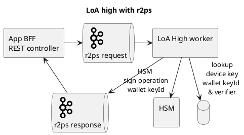

# LoA high with r2ps



```plantuml
!include <cloudinsight/kafka>
title Partioning of requests

rectangle "App BFF\nREST controller" as webapp
queue "<$kafka>\nr2ps request" as kafkaRequest

node "more secure hosting\n requirements for LoA high" {
    rectangle "LoA High worker 1 \nLocal in memory session store" as worker1
    rectangle "HSM 1\n" as hsm1
    rectangle "LoA High worker 2 \nLocal in memory session store" as worker2
    rectangle "HSM 2\n" as hsm2
    rectangle "LoA High worker N \nLocal in memory session store" as workerN
    rectangle "HSM N\n" as hsmN
}

node "LoA substantial" {
    rectangle "LoA Substantial worker 1 \nLocal in memory session store" as workerLoaSub1
    rectangle "LoA Substantial worker 2 \nLocal in memory session store" as workerLoaSub2
    rectangle "LoA Substantial worker N \nLocal in memory session store" as workerLoaSubN
}

database "SessionRepository" as session
webapp -down-> kafkaRequest

kafkaRequest -down-> worker1
kafkaRequest -down-> worker2
kafkaRequest -down-> workerN

kafkaRequest -down-> workerLoaSub1
kafkaRequest -down-> workerLoaSub2
kafkaRequest -down-> workerLoaSubN

session -up-> webapp
workerLoaSub1 -down-> session
workerLoaSub2 -down-> session
workerLoaSubN -down-> session

worker1 -down-> hsm1
worker2 -down-> hsm2
workerN -down-> hsmN
```
